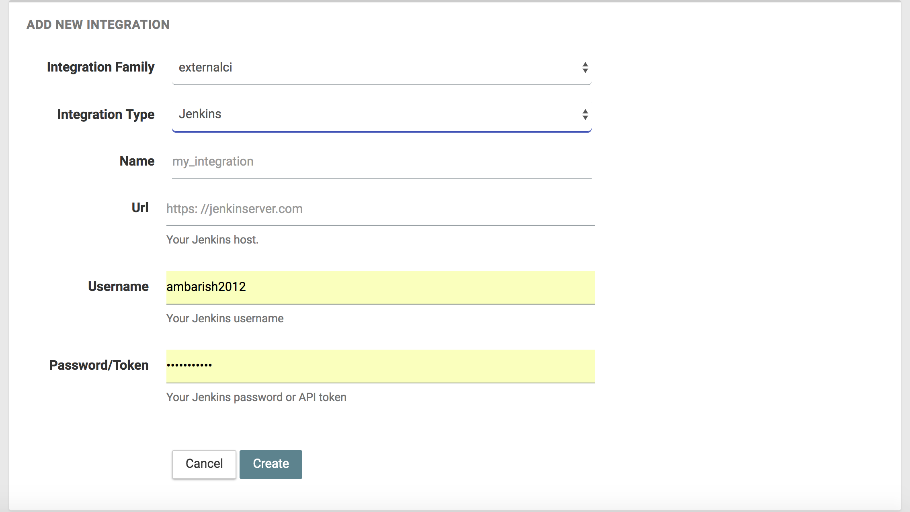

page_main_title: Jenkins
main_section: Platform
sub_section: Integrations
page_title: Jenkins integration

# Jenkins integration

The [Jenkins](https://jenkins.io/) integration is required if you want to run Jenkins jobs as part of your DevOps Assembly Lines.

This page explains how you can add a Jenkins integration to your account by providing the credentials and URL to access your Jenkins server.

## Adding account integration

You can add this account integration by following steps on the [Adding an account integration](/platform/management/integrations/#adding-an-account-integration) page.

Here is the information you need to create this integration:

* **Integration Family** -- **external ci**
* **Integration type** -- **Jenkins**
* **Name** -- choose a friendly name for the integration
* **Url** -- Enter your Jenkins server URL
* **Username** -- Username of your Jenkins account
* **Password/Token** -- Enter your Jenkins token

## Usage in Assembly Lines

The Jenkins integration can be used in the following [resources](/platform/workflow/resource/overview/):

* [integration](/platform/workflow/resource/integration)

##Further Reading

* [jenkinsJob](/platform/workflow/job/jenkinsjob/)
