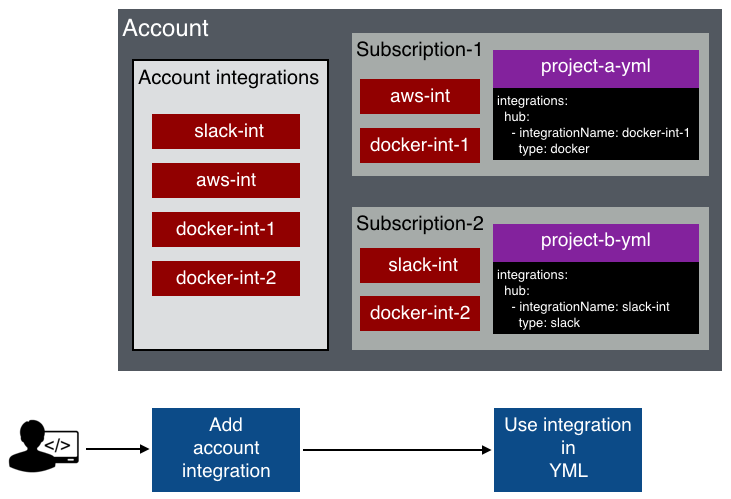

page_main_title: Overview
main_section: Platform
sub_section: Tutorials
sub_sub_section: Resources
page_title: DevOps Assembly Line Integrations
page_description: How to add, delete and update Integrations
page_keywords: Deploy multi containers, microservices, Continuous Integration, Continuous Deployment, CI/CD, testing, automation, pipelines, docker, lxc

# Working with Integrations
Shippable DevOps Platform leverages a declarative syntax for CRUD operations on Resources. A YML `shippable.resources.yml` config file is used to define them. It is added to your the root of your source code repo just like any other piece of code and the platform recognizes the changes you make to it through webhooks and sync the definitions.

Using an integration is a two step process:

Shippable is designed to separate out sensitive authentication information from resources.
This is done to ensure there are no encryption/decryption or permissions issues when you move things around i.e. moving resource definitions from one repository to another, or if the person who created the pipeline is no longer the member of the team etc. Integrations are specified as a property in the YML definition for resources that connect to third party services.

##Basic config
###1. Adding an integration to your account

To add an account integration:

- Click on the gear icon at the right of your top navigation bar to open **Account Settings**
- Click on **Integrations** in the left sidebar menu. This will show you a list of your integrations.
- Click on **Add integration** to add a new integration.
- Select the one you want from the list, complete all fields, and click on **Save**
- Please note that while creating the integration, you will need to specify which Subscriptions have access to it. This is a very important step and if you miss it, you will not be able to use it in your ymls.

###2. Using the integration in your yml
Once an integration is enabled for a Subscription, you can use it in any project in that Subscription with a few lines of yml configuration. Please note that the integration name in your yml should be same as the one configured in your integration.

##Advanced config

###Adding your integration to additional Subscriptions

If you need to use an integration in additional Subscriptions after it was created, you can add it to the Subscription by following the steps below:

- From the Subsciption dropdown menu at the top left of your Dashboard, click on the Subscription you need.

- Go to the **Settings** tab and click on **Integrations** in the left sidebar.
- Click on the **Add integration** button
- Name your integration and then in the **Account integrations** dropdown, select the integration you want to add. To keep it easy, name your integration with the same name as your account integration.
- If you want to restrict usage of the integration to specific projects, choose the Project(s). You can just leave it at *All projects* to let all projects in the Subscription use it.
- Click on **Save**. Please note that the name of your integration in your Subscription Settings should be used when referring to this integration in your `yml` files.

## Further Reading
* Working with Resources
* Working with Integrations
* Jobs

## TODO
| Tasks   |      Status    |
|----------|-------------|
| Hotlinking |  Open |
| Further Reading needs thinking|  Open |
| Need to update migration|  Open |